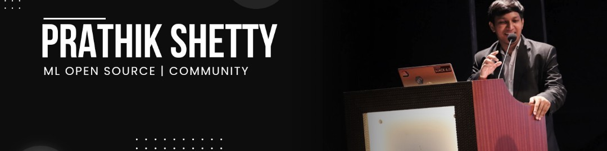

<h1 align="center">Hey folks🙌, I'm Prathik Shetty💫</h1>
<h3 align="center">Building @Genosisx , Community Maintainer at Mindsdb</h3>
<h3 align="center">Code, Coffee & Community❤️</h3>

  

# 💫 About Me:

 👯 I’m looking to collab on Community & Content  🌱 I’m currently learning TensorFlow , Django & React  💬 Ask me about Machine Learning/AI , Linux and Open Source  📫 How to reach me linuxmint78@gmail.com  ⚡ Fun fact -  Deep learning is really Deep haha :) 

## 🌐 Socials:
   

# 💻 Tech Stack:
             	    
# 📊 GitHub Stats:
 
 

## 💰 You can help me by Donating
   

